# emojifonts

macOS-renderable color emoji fonts, rebuilt automatically from upstream.

Upstream emoji fonts often ship in formats macOS can't draw (COLRv1, CBDT). This repo
rebuilds each one into the formats Core Text *does* render — **sbix**, **COLRv0**,
**OT-SVG** and plain **glyf** — and publishes them to a rolling
[`latest`](https://github.com/iebb/emojifonts/releases/latest) pre-release.

## Comparison

3 representative emoji per category, rendered from the locally built release fonts.
Each cell shows three 32 px glyphs; a dash means the font has no glyph for that set.

### Color sets

| | Apple | Noto | Twemoji | OpenMoji | Blobmoji | Toss Face | Fluent 3D | Fluent Flat | EmojiTwo |
| --- | --- | --- | --- | --- | --- | --- | --- | --- | --- |
| **Smileys**<br>😀 😂 😍 |  |  |  |  |  |  |  |  |  |
| **People**<br>👋 🤔 💪 |  |  |  |  |  |  | 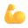 | 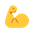 |  |
| **Animals**<br>🐶 🐱 🐼 |  | 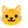 |  |  |  |  |  |  |  |
| **Food**<br>🍕 🍔 🍣 |  |  |  | 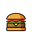 | 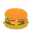 |  |  |  |  |
| **Travel**<br>🚗 ✈ 🚀 |  |  |  |  |  |  |  |  |  |
| **Activity**<br>⚽ 🎮 🎸 |  | 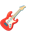 |  | 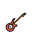 |  |  | 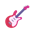 |  |  |
| **Objects**<br>💡 📱 🎁 |  |  |  | 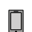 |  |  |  |  |  |
| **Symbols**<br>❤ ⭐ 🔥 |  |  |  |  |  |  |  |  |  |
| **Flags**<br>🏁 🏴 🚩 | 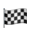 |  |  |  |  |  | 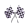 |  |  |
| **Country flags**<br>🇺🇸 🇯🇵 🇬🇧 |  |  |  |  |  |  | — | — |  |

> Fluent 3D, Fluent Flat, and Fluent Mono have no country-flag glyphs.

### Monochrome sets

Monochrome fonts render in whatever color the surrounding text uses (shown here
on a transparent background — they appear black in light mode).

| | Noto Mono | Fluent Mono |
| --- | --- | --- |
| **Smileys**<br>😀 😂 😍 |  |  |
| **People**<br>👋 🤔 💪 |  |  |
| **Animals**<br>🐶 🐱 🐼 |  |  |
| **Food**<br>🍕 🍔 🍣 |  |  |
| **Travel**<br>🚗 ✈ 🚀 |  |  |
| **Activity**<br>⚽ 🎮 🎸 |  |  |
| **Objects**<br>💡 📱 🎁 |  |  |
| **Symbols**<br>❤ ⭐ 🔥 |  |  |
| **Flags**<br>🏁 🏴 🚩 |  |  |
| **Country flags**<br>🇺🇸 🇯🇵 🇬🇧 |  | — |

## Download

Direct links to the current **`latest`** pre-release (file sizes shown). Pick the
format your renderer supports — see [Formats](#formats) below.

| Vendor | License | sbix | COLRv0 | OT-SVG | mono |
|--------|---------|------|--------|--------|------|
| **Noto Color** | Apache / OFL | [10 MB](https://github.com/iebb/emojifonts/releases/download/latest/noto.ttf) | — | [14 MB](https://github.com/iebb/emojifonts/releases/download/latest/noto-svginot.ttf) | — |
| **Noto** (mono) | OFL-1.1 | — | — | — | [1.8 MB](https://github.com/iebb/emojifonts/releases/download/latest/noto-mono.ttf) |
| **Blobmoji** | OFL-1.1 | [12 MB](https://github.com/iebb/emojifonts/releases/download/latest/blobmoji.ttf) | — | — | — |
| **Fluent 3D** | MIT | [37 MB](https://github.com/iebb/emojifonts/releases/download/latest/fluent.ttf) | — | — | — |
| **Fluent Flat** | MIT | — | — | [6.3 MB](https://github.com/iebb/emojifonts/releases/download/latest/fluent-flat.ttf) | — |
| **Fluent** (mono) | MIT | — | — | — | [1.0 MB](https://github.com/iebb/emojifonts/releases/download/latest/fluent-mono.ttf) |
| **Twemoji** | CC-BY-4.0 | [27 MB](https://github.com/iebb/emojifonts/releases/download/latest/twemoji.ttf) | [1.7 MB](https://github.com/iebb/emojifonts/releases/download/latest/twemoji-colrv0.ttf) | [9.5 MB](https://github.com/iebb/emojifonts/releases/download/latest/twemoji-svginot.ttf) | — |
| **OpenMoji** | CC-BY-SA-4.0 | [6.4 MB](https://github.com/iebb/emojifonts/releases/download/latest/openmoji.ttf) | [2.5 MB](https://github.com/iebb/emojifonts/releases/download/latest/openmoji-colrv0.ttf) | [2.9 MB](https://github.com/iebb/emojifonts/releases/download/latest/openmoji-svginot.ttf) | — |
| **EmojiTwo** | CC-BY-4.0 | [19 MB](https://github.com/iebb/emojifonts/releases/download/latest/emojitwo.ttf) | — | — | — |
| **Toss Face** | free (Toss) | [12 MB](https://github.com/iebb/emojifonts/releases/download/latest/tossface.ttf) | — | — | — |

Every file lives at `…/releases/download/latest/<name>` — substitute the variant suffix:

```
https://github.com/iebb/emojifonts/releases/download/latest/<font>.ttf          # sbix (or mono)
https://github.com/iebb/emojifonts/releases/download/latest/<font>-colrv0.ttf   # COLRv0
https://github.com/iebb/emojifonts/releases/download/latest/<font>-svginot.ttf  # OT-SVG
```

This table is a snapshot of the rolling `latest`; the [Sets](#sets) table lists every
format each action *targets* — COLRv0 / OT-SVG variants land as those actions next rebuild.

**Programmatically:** [`manifest.json`](https://github.com/iebb/emojifonts/releases/download/latest/manifest.json)
(published alongside the fonts) lists every font with its label, license, upstream,
detected Emoji version, and a download URL per format:

```json
{ "key": "twemoji", "emoji_version": "17.0", "kind": "color",
  "formats": { "sbix": ".../twemoji.ttf", "colrv0": ".../twemoji-colrv0.ttf",
               "svginot": ".../twemoji-svginot.ttf" } }
```

## Formats

Color-emoji fonts carry the artwork in one of several tables; each renderer supports a
different subset. What we publish, and where it draws:

| Format | Filename | macOS | Chrome | Firefox | What's inside |
|--------|----------|:-----:|:------:|:-------:|---------------|
| **sbix** | `<font>.ttf` | ✓ | ✓¹ | ✓ | the vendor's **PNG bitmaps** — pixel-exact art (gradients, 3-D, texture) |
| **COLRv0** | `<font>-colrv0.ttf` | ✓ | ✓ | ✓ | layered **vector**, flat palette colors — sharp at any size, no gradients |
| **OT-SVG** | `<font>-svginot.ttf` | ✓ | ✗ | ✓ | full **vector SVG** with gradients — best vector fidelity |
| **glyf** (mono) | `<font>.ttf` | ✓ | ✓ | ✓ | plain outlines, **no color** — paints in the current text color |

¹ Chrome/Skia can't read sbix directly, so our sbix builds embed empty "box" `glyf`
outlines: Chrome maps the codepoint to a glyph and then shows the bitmap over it.

- **sbix** (bitmap) — the universal default; every color set ships it. Reproduces the
  vendor's art exactly, because it *is* their PNGs. Trade-offs: largest files, and a
  fixed resolution (soft if blown up far past the strike size). Native on macOS; Chrome
  needs the box-glyf trick above.
- **COLRv0** (flat vector) — tiny, infinitely sharp, renders in every modern engine.
  But each glyph is a stack of solid-color shapes from a palette, so it only fits art
  that's *already* flat (Twemoji, OpenMoji). Gradient-heavy sets (Noto, Fluent 3-D)
  can't be expressed without exploding the glyph count and dropping their shading, so
  they get no COLRv0.
- **OT-SVG** (vector + gradients) — keeps gradients and fine detail at any size for a
  fraction of a bitmap's bytes. The catch: Chrome's Skia ignores the `SVG ` table (you
  get fallback/tofu), so it's effectively a **macOS + Firefox** format.
- **glyf (mono)** — not color at all: a normal outline font that paints in whatever
  color the surrounding text is, like an icon/dingbat font. Works literally anywhere
  text renders. (Noto mono, Fluent mono.)

macOS Core Text renders sbix, COLRv0, OT-SVG and plain glyf — but **not COLRv1 or
CBDT**, which is exactly why upstream CBDT/COLRv1 fonts are rebuilt here.

## Sets

Work is organised as **actions** — one per upstream repo — each producing one or more
variant fonts:

| Action (upstream) | Font(s) | License | Built as |
|-------------------|---------|---------|----------|
| `noto` · [googlefonts/noto-emoji](https://github.com/googlefonts/noto-emoji) | `noto` | Apache-2.0 / OFL | sbix + OT-SVG |
| `noto-mono` · [google/fonts](https://github.com/google/fonts) | `noto-mono` | OFL-1.1 | as-is (mono glyf) |
| `blobmoji` · [C1710/blobmoji](https://github.com/C1710/blobmoji) | `blobmoji` | OFL-1.1 | sbix + OT-SVG |
| `fluent` · [tetunori/fluent-emoji-webfont](https://github.com/tetunori/fluent-emoji-webfont)² | `fluent`, `fluent-flat` | MIT | sbix (3D) + OT-SVG (flat) |
| `fluent-mono` · [microsoft/fluentui-emoji](https://github.com/microsoft/fluentui-emoji) | `fluent-mono` | MIT | mono glyf (from High-Contrast SVGs) |
| `twemoji` · [jdecked/twemoji](https://github.com/jdecked/twemoji) | `twemoji` | CC-BY-4.0 | sbix + COLRv0 + OT-SVG |
| `openmoji` · [hfg-gmuend/openmoji](https://github.com/hfg-gmuend/openmoji) | `openmoji` | CC-BY-SA-4.0 | sbix + COLRv0 + OT-SVG (prebuilt) |
| `emojitwo` · [EmojiTwo/EmojiTwo](https://github.com/EmojiTwo/EmojiTwo) | `emojitwo` | CC-BY-4.0 | sbix + COLRv0 + OT-SVG |
| `tossface` · [toss/tossface](https://github.com/toss/tossface) | `tossface` | free | as-is (sbix) |

**Build notes.** sbix builds get box-glyf outlines so they render in Chrome (Skia), not
just Core Text. OT-SVG is built from per-codepoint SVGs (via nanoemoji/picosvg,
normalized to 1 em). For SVG-sourced sets (Twemoji, EmojiTwo) the **sbix** is rasterized
straight from the SVGs with resvg and assembled over the COLRv0's cmap+GSUB — ~10×
faster than nanoemoji's bitmap pass, and normalized to a clean 1-em advance. If a COLRv0
build ever overflows TrueType's 65 535-glyph cap it drops the least-common emoji
(multi-person skin-tone sequences first) until it fits — which is also why
gradient-heavy CBDT sets (Noto, Blobmoji) ship sbix only. OpenMoji ships its own
prebuilt sbix / COLRv0 / OT-SVG upstream, so those are downloaded directly (sbix gets
box-glyf added). ² Fluent's art is Microsoft's
[fluentui-emoji](https://github.com/microsoft/fluentui-emoji) (MIT); the color builds
come from tetunori's webfont, which is the upstream this action tracks.

See **[VERSIONS.md](VERSIONS.md)** for each font's detected Unicode Emoji version.

## Automation

- **Per-action weekly** (`build-<action>.yml`, staggered Mondays): each compares its
  upstream's latest commit to `versions/<action>.json` and **rebuilds only if that
  upstream changed**, publishing every font it produces to the rolling **`latest`**
  pre-release. Run any one individually (Actions → *<action>* → Run workflow). Shared
  logic lives in the reusable [`_build.yml`](.github/workflows/_build.yml).
- **Docs** ([`docs.yml`](.github/workflows/docs.yml)): single writer of `VERSIONS.md`,
  triggered after each build (and weekly), regenerating it from `versions/*.json`.
- **Monthly** ([`release.yml`](.github/workflows/release.yml), 1st): snapshots `latest`
  into a dated `YYYY.MM` release.

## Build locally

```bash
scripts/build.sh twemoji      # build one font's variants → dist/
scripts/build.sh fluent       # → fluent.ttf (3D), fluent-flat.ttf
python build_noto.py build    # each font has its own one-line generation script
python build_noto.py changed  # print the action iff its upstream changed
python common.py build-all    # everything · common.py holds the shared build code
```

Each font names a **builder** in [`sources.json`](sources.json), so its pipeline is
explicit and tuned to its source:

| Builder | Used by | What it does |
|---------|---------|--------------|
| `cbdt_sbix` | Noto, Blobmoji, Fluent 3D | lift CBDT bitmaps into an sbix strike (centred on the em) + box glyf; + OT-SVG if the set has SVGs (Noto, Blobmoji) |
| `otsvg` | Fluent Flat | keep the source webfont's vector OT-SVG, drop the bitmap/COLRv1 tables macOS can't render |
| `svg_mono` | Fluent (monochrome) | a true monochrome glyf font (renders in the text colour) via nanoemoji's mono `glyf`, from MS's High-Contrast SVGs |
| `download` | Toss Face, mono Noto, OpenMoji | take the upstream font as-is (+ optional box glyf / prebuilt COLRv0 / prebuilt OT-SVG) |
| `svg_color` | Twemoji, EmojiTwo | COLRv0 + OT-SVG via nanoemoji (normalized); sbix via resvg over its cmap+GSUB |

The shared build code is in [`common.py`](common.py) (`BUILDERS` registry); each font has a
one-line generation script `build_<font>.py` that calls it.
